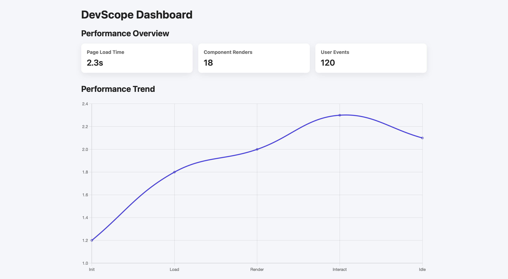

## DevScope Dashboard

DevScope is a frontend performance monitoring dashboard built using React.  
It visualizes real browser-based metrics such as page load time, user interactions, render cycles, FPS, and a derived performance score — all without a backend.

---

## 🚀 Key Features

- Real page load time measurement using Browser Performance API
- Live FPS (Frames Per Second) tracking via `requestAnimationFrame`
- User interaction tracking (clicks & key events)
- Controlled component render count
- Dynamic performance score calculation
- Interactive charts for live metrics visualization
- Dark / Light mode toggle
- Responsive and clean dashboard UI

---

## 🛠 Tech Stack

- React (Hooks, Functional Components)
- JavaScript (ES6+)
- Recharts (Data Visualization)
- HTML5 & CSS3
- Netlify (Deployment)

---

## 📊 What This Project Demonstrates
- Strong understanding of React fundamentals
- Component reusability using props
- Data-driven UI development
- Integration of third-party visualization libraries
- Scalable and maintainable front-end structure

---

## 📸 Screenshots

### 👨‍💻 Author
Built as a learning-focused project to strengthen front-end engineering and dashboard development skills.
